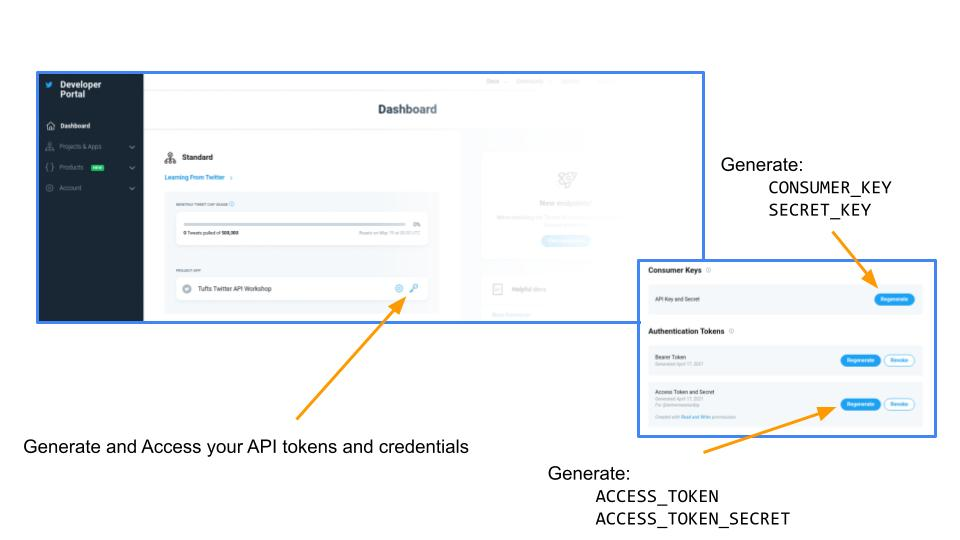

# Twitter Bots

The rise of Twitter as a critical tool in public discourse has sparked important conversations about the role of Twitter bots in shaping the social media dialogue.  Automated tweets amplify content posted by politicians and public figures, spam bots flood hashtags to obscure messaging and protest bots call attention to #HashtagActivism through targeted content.  Behind each of these bots is the infrastructure of the Twitter API and the set of development tools to programmatically access it.  

In this 2-hour [Tufts DISC](https://disc.tufts.edu/) workshop we'll learn about the various ways that bots can leverage the Twitter API to shape conversation by amplifying messages through likes, follows, and retweets and creating messages through generative content. Along the way we'll learn how to build and deploy a simple bot using Tracery to generate text from JSON files using public domain text corpora.

### Workshop Materials

* Colab Notebook
* [Slides](https://docs.google.com/presentation/d/1RFPJuvYtTUZ2zcI-KBq5tSjwbmtFJRPkSToolKpgIpA/edit?usp=sharing)

### Setting Up Your Developer Account

In case you want to access the Twitter API you'll need to have a Twitter developer account.  You can apply for access as an academic researcher at the [Twitter Developer Portal](https://developer.twitter.com/en/solutions/academic-research/products-for-researchers).  This process usually take several days.

Once you've been granted access, you can login to your [Developer Dashboard](https://developer.twitter.com/en/portal/dashboard) to retrieve your access tokens. 

Be sure to copy down your keys and tokens into a text file where you can find them later. 

# Useful Resources
* [Twitterbot Workshop by Ryan Cordell](https://ryancordell.org/teaching/Twitterbot-Workshop/)
* Slides, [_How	to	Make	a	Twitter	Bot	in	1	Hour	or	Less_](https://dsg.neu.edu/wp-content/uploads/2017/04/BotsWorkshop.pdf) by [Élika Ortega](https://elikaortega.net/)
* [Twitter Developer Portal](https://developer.twitter.com/en/portal/dashboard)
* [Cheap Bots Done Quick](https://cheapbotsdonequick.com/)
* [Building a Twitter bot using Python with Tweepy](https://realpython.com/twitter-bot-python-tweepy/).
